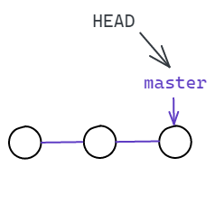
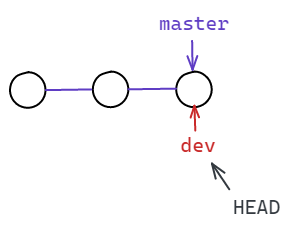
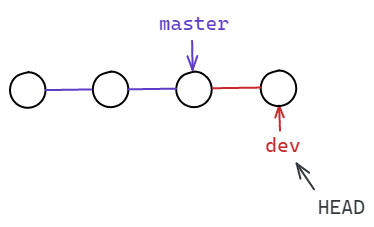
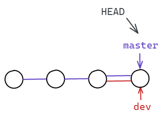
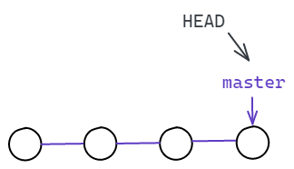
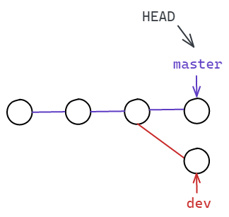
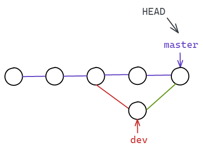
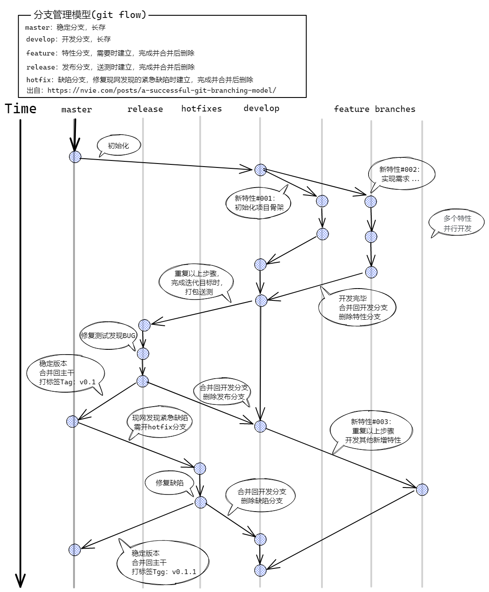

# 关于 Git 的用法指南

### 前言

本文将整理常用的 git 命令，帮助开发人员快速上手，同时记录常见的问题及其解决方案。

### 基本命令

#### 初始化

通过 `git init` 命令初始化一个空仓库，同时在当前目录下新建 `.git` 目录，该目录是 git 跟踪管理版本的库，同时包含所有操作的配置信息，默认隐藏。

```shell
$ git init
Initialized empty Git repository in /Users/Silence/learngit/.git/
```

#### 作者信息

在操作仓库前需要先设置个人信息，包含 `邮箱地址` 和 `用户名`

```shell
$ git config --global user.email "sparrow_silence@163.com"
$ git config --global user.name "Silence"
```

#### 添加文件到仓库

假设当前目录下有 `readme.md` 文件，通过命令 `git add` 将该文件添加到仓库。

```shell
$ git add readme.md
```

#### 查看仓库状态

通过 `git status` 命令可查看当前仓库的变更信息，未提交的文件将出现在 `Untracked files` 列表里。已经添加的在 `Changes to be committed` 列表里。

```shell
$ git status
On branch master

Changes to be committed:
  (use "git rm --cached <file>..." to unstage)
        new file:   README.md

Untracked files:
  (use "git add <file>..." to include in what will be committed)
        .gitignore
```

#### 提交文件到仓库

命令 `git commit -m 'type anything'` 将已经添加的文件提交到仓库，仓库保存为历史记录。

```shell
$ git commit -m 'init project'
[master bf5fc33] init project
 1 file changed, 7 insertions(+)
 create mode 100644 .gitignore
```

#### 查看仓库历史记录

命令 `git log` 查看仓库的所有提交记录。

```shell
$ git log
commit bf5fc33fdd8447d2e5ae40ec9867d9a8ea9fd1fd (HEAD -> master)
Author: Silence <sparrow_silence@163.com>
Date:   Sat Oct 30 10:26:57 2021 +0800

    init project
    
commit a1af351ed53dfb1f24e06af662025de8951e10bf (dev)
Author: Silence <sparrow_silence@163.com>
Date:   Sat Oct 30 10:13:54 2021 +0800

    测试commit
```

在后面加上 `--pretty=oneline` 参数，输出的记录会更简洁。

```shell
$ git log --pretty=oneline
bf5fc33fdd8447d2e5ae40ec9867d9a8ea9fd1fd (HEAD -> master) init project
a1af351ed53dfb1f24e06af662025de8951e10bf (dev) 测试commit
```

#### 版本回退

首先 Git 需要知道回退记录的 `HEAD`，也就是 `git log` 输出的记录里 `bf5fc33fdd...`，用 `HEAD` 表示当前版本，那 `HEAD^` 就是上一个版本，`HEAD^^` 是上上版本，以此类推，往上100个版本写成 `HEAD~100`。

命令 `git reset --hard HEAD^` 将回退到上一个版本

```shell
$ git reset --hard HEAD^
HEAD is now at a1af351 测试commit
```

也可以指定 `commit id` 回退，一般来说输入前几位就行， Git 会自动去找

```shell
$ git reset --hard bf5fc
HEAD is now at bf5fc33 init project
```

只要知道 `commit id` 就可以恢复到该记录，如果回退后， `git log` 中查不到 `commit id` ，可通过 `git reflog` 查看，该命令记录每一次命令。

```shell
$ git reflog
bf5fc33 (HEAD -> master) HEAD@{0}: reset: moving to bf5fc
a1af351 (dev) HEAD@{1}: reset: moving to HEAD^
bf5fc33 (HEAD -> master) HEAD@{2}: commit: init project
a1af351 (dev) HEAD@{3}: commit (initial): 测试commit
```

### 工作区和暂存区

#### 工作区

工作区就是建仓时所在的目录

#### 暂存区

工作区里的 `.git` 目录是 Git 的版本库。版本库里存了很多东西，其中最重要的就是 `stage` 暂存区，还有建仓时为我们自动创建的第一个分支 `master`,以及指向 `master` 的第一个指针 `HEAD`。 


所以 `git add` 的命令就是将所有修改放到暂存区 `stage`，然后执行 `git commit` 命令就可以把暂存区里所有修改都提交到分支，提交完成后，暂存区就没有任何内容了。

#### 撤销修改

##### 丢弃工作区的修改

命令 `git checkout -- file` 能够撤销修改。在修改某个文件内容后，如在 ` README.md` 文件里增加一行 `stupid boss`，使用该命令可回退到修改前状态。若已提交到暂存区则无法完成撤销修改，但提交后的修改仍可撤销。

注意命令中的 `--`，如果去掉则是切换分支命令。

```shell
$ git checkout -- README.md
```

##### 已添加到暂存区，丢弃全部修改

参考版本回退命令 `git reset HEAD <file>`，可回退到最新的分支版本，然后使用 `git checkout -- file` 撤销修改。

##### 撤销已提交的修改

如果还未提交到远程库，参考版本回退命令

#### 删除操作

删除的本质也是修改，一般情况下，通过文件管理器或者命令 `rm` 删除文件或目录。通过 `git status` 可查看当前库删除了哪些文件。

```shell
$ rm test.txt
$ git status
Changes not staged for commit:
  (use "git add/rm <file>..." to update what will be committed)
  (use "git restore <file>..." to discard changes in working directory)
        deleted:    test.txt
```

- 确认从版本库中删除，使用命令 `git rm` 删除该文件，并且 `git commit`

  ```shell
  $ git rm test.txt
  rm 'test.txt'
  $ git commit -m 'remove test.txt'
  [master 9aefaf0] remove test.txt
   1 file changed, 0 insertions(+), 0 deletions(-)
   delete mode 100644 test.txt
  ```

- 误删，从版本库中恢复，命令 `git restore <file>` 或 `git checkout -- file` 恢复文件，前提是版本库中仍有该文件。

  ```shell
  $ git restore test.txt
  
  $ git checkout -- test.txt
  ```

### 远程仓库

#### 远程库

远程库的服务器完全可以自己搭建，也可以使用现有的，比如 [GitHub](https://github.com) 和 [Gitee](https://gitee.com) 网站，他们都提供 Git 仓库托管服务。

由于 `GitHub` 和 `Gitee` 和本地仓库的传输是通过 `SSH` 加密的，所以需要创建 `SSH key` ，若已创建，在本地用户主目录下，会有 `.ssh` 目录，里面包含 `id_rsa` 和 `id_rsa.pub` 两个文件。若没有，可通过下面的命令生成

```shell
$ ssh-keygen -t rsa -C "sparrow_silence@163.com"
```

然后一路回车，使用默认值即可，成功生成后就能看到 `.ssh` 目录，其中 `id_rsa` 是私钥，不能泄露出去，`id_rsa.pub` 是公钥，是需要在 `GitHub` 和 `Gitee` 网站上配置的，可以放心交出，仓库托管网站通过公钥确认是你本人推送。

#### 添加远程库

假设现在本地有个 Git 仓库，`GitHub` 上也有个仓库，让这两个仓库进行远程同步，这样，远程库就可以作为备份，即使本地库丢失，也能从远程库恢复，还可以共享自己的仓库来协作。

首先在远程库网站上新建空白仓库，获取远程仓库地址，`HTTPS` 或 `SSH` 都可以，但是 `HTTPS` 每次都需要输入口令，过于麻烦。但是某些公司只开放 `HTTP` 端口，就无法使用 `SSH` 协议，只能使用 `HTTPS` 协议。

```shell
$ git remote add origin git@github.com:SparrowXc/learngit.git
```

`origin` 是远程仓库的默认名称，可以更改。然后将本地仓库的所有内容推送到远程库上：

```shell
$ git add .
$ git commit -m 'init project'
$ git push -u origin master
```

因为远程库是空仓库，在第一次推送 `master` 分支时，加上了 `-u` 参数，Git 会将本地的 `master` 分支和远程的 `master` 分支关联起来，简化之后的推送命令。之后运行命令 `git push` 就能完成推送。

#### 删除远程库关联

使用命令 `git remote rm <name>` 取消本地仓库关联的远程仓库，可以先通过 `git remote -v` 查看当前的关联信息：

```shell
$ git remote -v
origin git@github.com:SparrowXc/flexible-form.git (fetch)
origin git@github.com:SparrowXc/flexible-form.git (push)
```

然后根据远程仓库名称删除：

```shell
$ git remote rm origin
```

#### 从远程库克隆

一般来讲，从零开发的最好方式就是先创建远程仓库，然后本地克隆远程仓库。

```shell
$ git clone git@github.com:SparrowXc/flexible-form.git
Cloing into 'flexible-form'...
```

这样就完成了本地仓库和远程仓库的同步。

> 也可以通过克隆远程仓库，将目录下的 `.git` 目录移动到本地项目目录里，这样就能省去本地仓库的初始化和关联远程仓库等步骤。

### 分支管理

Git 里的分支就像是平行空间，互不干扰，但也能实现空间的合并。

#### 创建与合并分支

每次提交， Git 都会把它们串成一条时间线，也就是分支。默认情况，只有一条主分支， `master` 指向分支上的最新提交，而 `HEAD ` 指向 `master` ,也就是当前提交所在的分支：



当创建一个新分支 `dev` 时, Git 也就新建了一个指针 `dev`, 和 `master` 指向相同的提交，再让 `HEAD` 指向 `dev`：

```shell
$ git switch -c dev
Switched to a new branch 'dev'
```

`git switch` 命令加上 `-c` 参数表示创建并切换分支，相当于下面两条命令：

```shell
$ git branch dev
$ git switch dev
```




接下来的提交操作都是针对 `dev` 分支上的修改， `master` 分支不会发生变化：

命令 `git branch` 会列出所有分支，并在当前分支上用 `*` 作标记

```shell
$ git branch
* dev
  master
```

在 `dev` 分支上修改内容并提交：

```shell
$ git add README.md
$ git commit -m 'test dev commit'
[dev ea05c38] test dev commit
 1 file changed, 2 insertions(+)
```



如果合并两个分支，只需要把 `master` 的指向移动到 `dev` 当前的提交，就完成了合并：

命令 `git switch` 可切换回主分支，再用 `git merge` 命令合并指定分支到当前分支：

```shell
$ git switch master
Switched to branch 'master'

$ git merge dev
Updating 3356979..ea05c38
Fast-forward
 README.md | 2 ++
 1 file changed, 2 insertions(+)
```

`Fast-forwar` 信息表示这次的合并是『快进模式』,也就是直接把 `master` 指向 `dev` 的最新提交，所以合并速度非常快，当然也还有其他的合并模式。



合并完成后，使用命令 `git branch -d` 可以删除 `dev` 分支，也就是删除 `dev` 指针：

```shell
$ git branch -d dev
Deleted branch dev (was ea05c38).
```




#### 解决冲突

假设创建新分支，并在新分支上修改内容并完成提交。然后再回到主分支上，也修改内容并提交，就会不同的分支线：



这种情况下，Git 无法执行『快速合并』，只能试图把各自的修改合并起来，但可能会有冲突：

```shell
$ git switch -c dev
# 修改内容
$ git add README.md && git commit -m 'dev commit'
$ git switch master
# 修改内容
$ git add README.md && git commit -m 'master commit'
# 合并
$ git merge dev
Auto-merging README.md
CONFLICT (content): Merge conflict in README.md
Automatic merge failed; fix conflicts and then commit the result.
```

默认会自动合并修改，并用 `<<<<<<<`, `=======`，`>>>>>>>` 标记出不同分支的内容

此时的 `README.md` 文件：

```markdown
<<<<<<< HEAD
Creating a new branch is quick & simple.
=======
Creating a new branch is quick AND simple.
>>>>>>> dev
```

命令 `git status` 也能查看冲突的文件：

```shell
$ git status
On branch main
You have unmerged paths.
  (fix conflicts and run "git commit")
  (use "git merge --abort" to abort the merge)

Unmerged paths:
  (use "git add <file>..." to mark resolution)
        both modified:   README.md
```

现在再提交，`master` 和 `dev` 分支如图所示：



用带参数的 `git log` 命令可以查看合并情况：

```shell
$ git log --graph --pretty=oneline --abbrev-commit
*   d5af4bb (HEAD -> master) merge commit
|\
| * 06516ee (dev) dev commit
* | 595f76b master commit
|/
* 73cc783 init project
```

#### 分支管理策略

Git 在使用 `Fast-forward` 模式合并分支后，删除分支就会丢掉分支信息。通过加参数 `--no-ff` 可以强制禁用 `Fast-forward` 模式，生成一个新的 `commit`，在分支历史中也能看出分支信息。

在实际开发中，我们应该按照几个基本原则进行分支管理：

首先，`master` 分支应该是非常稳定的，也就是仅用来发布新版本，平时不能在上面提交代码；

提交代码活都在 `dev` 分支上，也就是说，`dev` 分支是不稳定的，比如到 1.0 版本发布时，再把 `dev` 分支合并到 `master` 上，在 `master` 分支发布 1.0 版本；

团队里每个人都在 `dev` 分支上干活，每个人都有自己的分支，时不时地往 `dev` 分支上合并。



#### Bug 分支

开发中经常会遇到修复 Bug 的任务，但在 `dev` 分支上的开发任务还没完成，又不想先提交，可以用 `git stash` 命令将当前工作区的状态保存为一次快照。然后就可以切换到 `master` 分支上，新建一个 Bug 修复分支，比如 `issue-125`:

```shell
$ git stash
Saved working directory and index state WIP on dev: d5af4bb merge commit
# 创建并切换到issue-125分支
$ git switch -c issue-125
Switched to a new branch 'issue-125'
```

现在可以在新建的分支上完成 Bug 修复任务，修复完成后，合并回 `master` 分支，再回到 `dev` 分支上继续工作：

```shell
# 修复bug，添加并提交
$ git add 'bug files'
$ git commit -m 'fix bug 125'
# 在主分支合并修复bug分支
$ git merge --no-ff -m 'merged bug fix 125' issue-125
# 回到dev分支上继续开发
$ git switch dev
```

回到 `dev` 分支后，命令 `git stash list` 可查看保存的快照列表：

```shell
$ git stash list
stash@{0}: WIP on dev: d5af4bb merge commit
```

从快照中恢复到本地工作区有两种方法，一个是用 `git stash apply`，这个命令恢复后，并不会删除 `stash` 里的内容，需要再用 `git stash drop` 来删除；

另一种方法是用 `git stash pop`,恢复的同时把 `stash` 内容也删除：

```shell
#第一种方法
$ git stash apply stash@{0}
# 另一种方法
$ git stash pop
On branch dev
Changes not staged for commit:
  (use "git add <file>..." to update what will be committed)
  (use "git restore <file>..." to discard changes in working directory)
        modified:   README.md

no changes added to commit (use "git add" and/or "git commit -a")
Dropped refs/stash@{0} (025af7f2371138accb8e5e92e4b1ec1f2e4a7285)
# 再次查看stash列表
$ git stash list
# 快照内容被删除了
```

`master` 分支上是从 `dev` 分支上分出来的，所以这个 Bug 也存在于 `dev` 分支上。现在 `maseter` 分支上的 Bug 已经修复，如何快速修复 `dev` 分支上的呢。Git 提供了 `cherry-pick` 命令，让我们能复制一个特定的提交到当前分支：

```shell
$ git cherry-pick b4c8a06
[dev 2293244] fix bug 125
 Date: Mon Nov 1 14:59:22 2021 +0800
 1 file changed, 5 insertions(+), 5 deletions(-)
```

#### Feature 分支

开发过程中，增加新功能也需要在新的分支上完成，也就是 `feature` 分支，确保不会污染主分支，后续的操作和 `bug` 分支是基本一致的。在将 `feature` 分支合并到主分支前，想取消该功能，并删除分支，Git 会提示当前分支未进行任何合并操作，如果删除，将丢失修改，这时候就需要使用 `-D` 参数强制删除。

```shell
$ git branch -D feature-001
Deleted branch feature-101 (was 2293244).
```

#### 多人协作

通常团队的协作工作模式是这样的：

1. 本地尝试 `git push origin <branch-name>` 推送自己的修改；
2. 若推送失败，是因为本地分支需要更新，使用 `git pull` 命令合并；
3. 若合并有冲突，解决冲突，并在本地提交；
4. 若没有冲突，或已解决冲突，再用 `git push origin <branch-name>` 完成推送；

如果 `git pull` 提示 `no tracking information`，则说明本地分支和远程分支未建立链接关系，用命令 `git branch --set-upstream-to <branch-name> origin/<branch-name>` 建立链接。

#### Rebase 变基

[官方文档](https://git-scm.com/book/zh/v2/Git-分支-变基)

在团队协作环境下，经常需要先 `git pull` 远程分支，在本地合并后才能 `git push`。而每次合并后，提交分支历史就会出现很多分叉，非常不美观。Git 提供 `rebase` 命令，该命令能将本地分支合并为一条分支，同时保证最终提交的修改是相同的。

```shell
$ git rebase master
First, rewinding head to replay your work on top of it...
Applying: added staged command
```


### 标签管理

在使用 Git 发布一个版本时，需要在版本库里打一个标签（tag)，标签能够作为唯一的快照版本号。标签实际上就是指向某个 commit 的指针（跟分支很像，但分支可以移动，标签不能移动），所以创建和删除标签都是瞬间完成的。commit 的id复杂无规律，不方便使用，所以需要一个标签来辅助定位 commit。

#### 创建标签

命令 `git tag <name>` 就可以在当前分支上打上新标签：

```shell
$ git tag v1.0.0
# 查看标签
$ git tag
v1.0.0
```

标签默认打在最新的提交上，当然也可以根据 commit id 打标签：

```shell
$ git tag v0.9.9 b4c8a06
# 查看标签
$ git tag
v0.9.9
v1.0.0
```

标签的顺序是按字母排序的，并不是按照时间排序，命令 `git show <tagname>` 可以查看标签详细信息：

```shell
$ git show v1.0.0
commit 2ffda2918fc0844c61c7cd6a1b69fc85353f09be (HEAD -> master, tag: v1.0.0)
Merge: d5af4bb b4c8a06
Author: Silence <sparrow_silence@163.com>
Date:   Mon Nov 1 14:59:52 2021 +0800

    merged bug fix 125
```

还可以创建带说明的标签， `-a` 参数指定标签名，`-m` 指定说明文字：

```shell
$ git tag -a v0.9.0 -m 'version 0.9.0 released' b4c8a06
$ git show tag v0.9.0
tag v0.9.0
Tagger: Silence <sparrow_silence@163.com>
Date:   Mon Nov 1 16:40:35 2021 +0800

version 0.9.0 released

commit b4c8a066431bdb97fc0ec690183ac54c8e4f97b9 (tag: v0.9.0, issue-125)
Author: Silence <sparrow_silence@163.com>
Date:   Mon Nov 1 14:59:22 2021 +0800

    fix bug 125

diff --git a/README.md b/README.md...
```

#### 操作标签

删除标签命令：

```shell
$ git tag -d v0.9.0
Deleted tag 'v0.9.0' (was bea5b26)
```

推送某个标签到远程，使用命令 `git push origin <tagname>`

```shell
$ git push origin v1.0.0
```

或者一次性推送所有未推送到远程的本地标签：

```shell
$ git push origin --tags
```

如果要删除已经推送到远程的标签，首先删除本地标签：

```shell
$ git tag -d v0.9
```

然后从远程删除：

```shell
$ git push origin :refs/tags/v0.9
```

### 总结

| Git Cheat Sheet                                        |                                                              |                                                              |
| ------------------------------------------------------ | ------------------------------------------------------------ | ------------------------------------------------------------ |
| GIT BASICS                                             |                                                              |                                                              |
| git init <directory>                                   | 在指定的⽬录下创建⼀个空的git repo。不带参数将在当前⽬录下创建⼀个git repo。 | Create empty Git repo in specified directory. Run with no arguments to initialize the current directory as a git repository. |
| git clone <repo>                                       | 克隆⼀个指定repo到本地。指定的repo可以是本地⽂件系统或者由HTTP或SSH指定的远程路径。 | Clone repo located at <repo> onto local machine. Original repo can be located on the local filesystem or on a remote machine via HTTP or SSH. |
| git config user.name <name>                            | 针对当前repo配置⽤户名。使⽤--global参数将配置全局⽤户名。   | Define author name to be used for all commits in current repo. Devs commonly use --global flag to set config options for current user. |
| git add <directory>                                    | 将指定⽬录的所有修改加⼊到下⼀次 commit中。把<directory>替换成<file>将添加指定⽂件的修改。 | Stage all changes in <directory> for the next commit. Replace <directory> with a <file> to change a specific file. |
| git commit -m "<message>"                              | 提交暂存区的修改，使⽤指定的 <message>作为提交信息，⽽不是打开⽂本编辑器输⼊提交信息。 | Commit the staged snapshot, but instead of launching a text editor, use <message> as the commit message. |
| git status                                             | 显示哪些⽂件已被staged、未被staged以及未跟踪(untracked)。    | List which files are staged, unstaged, and untracked.        |
| git log                                                | 以缺省格式显示全部commit历史。更多⾃定义参数请参考后续部分。 | Display the entire commit history using the default format. For customization see additional options. |
| GIT DIFF                                               |                                                              |                                                              |
| git diff                                               | ⽐较⼯作区和暂存区的修改。                                   | Show unstaged changes between your index and working directory. |
| git diff HEAD                                          | ⽐较⼯作区和上⼀次commit后的修改。                           | Show difference between working directory and last commit.    |
| git diff --cached                                      | ⽐较暂存区和上⼀次commit后的修改。                           | Show difference between staged changes and last commit        |
| UNDOING CHANGES                                        |                                                              |                                                              |
| git revert <commit>                                    | 对指定<commit>创建⼀个undo的 commit，并应⽤到当前分⽀。      | Create new commit that undoes all of the changes made in <commit>, then apply it to the current branch. |
| git reset <file>                                       | 将<file>从暂存区移除，但保持⼯作区不变。此操作不会修改⼯作区的任何⽂件。 | Remove <file> from the staging area, but leave the working directory unchanged. This unstages a file without overwriting any changes. |
| REWRITING GIT HISTORY                                  |                                                              |                                                              |
| git commit -m <message> --amend                        | 将当前staged修改合并到最近⼀次的 commit中。                  | Replace the last commit with the staged changes and last commit combined. |
| git rebase <base>                                      | 基于<base>对当前分⽀进⾏rebase。 <base>可以是commit、分⽀名称、tag或相对于HEAD的commit。 | Rebase the current branch onto <base>. <base> can be a commit ID, branch name, a tag, or a relative reference to HEAD. |
| git reflog                                             | 显示本地repo的所有commit⽇志。                               | Show a log of changes to the local repository’s HEAD.        |
| GIT BRANCHES                                           |                                                              |                                                              |
| git branch                                             | 显示本地repo的所有分⽀。                                     | List all of the branches in your repo.                       |
| git switch -c <branch>                                 | 创建并切换到⼀个新的名为<branch>的分 ⽀。去掉-c参数将切换到⼀个已有分⽀。 | Create and switch to a new branch named <branch>. Drop the -c flag to switch to an existing branch. |
| git merge <branch>                                     | 将指定<branch>分⽀合并到当前分⽀。                           | Merge <branch> into the current branch.                      |
| REMOTE REPOSITORIES                                    |                                                              |                                                              |
| git remote add <name> <url>                            | 添加⼀个新的远程连接。添加后可使⽤ <name>作为指定<url>远程连接的名称。 | Create a new connection to a remote repo. After adding a remote, you can use <name> as a shortcut for <url> in other commands. |
| git fetch <remote> <branch>                            | 从指定<remote>抓取指定<branch>的所有commit到本地repo。去掉<branch>将抓取远程所有分⽀的修改。 | Fetches a specific <branch>, from the repo. Leave off <branch> to fetch all remote refs. |
| git pull <remote>                                      | 从指定<remote>抓取所有分⽀的commit并⽴刻合并到本地repo。     | Fetch the specified remote’s copy of current branch and immediately merge it into the local copy. |
| git push <remote> <branch>                             | 将本地指定<branch>推送到指定远程 <remote>。如果远程没有对应的分⽀，将 ⾃动在远程创建此分⽀。 | Push the branch to <remote>, along with necessary commits and objects. Creates named branch in the remote repo if it doesn’t exist. |
| GIT CONFIG                                             |                                                              |                                                              |
| git config -- global user.name <name>                  | 配置当前⽤户名，使⽤--global参数将针对当前系统登录⽤户⽣效。 | Define the author name to be used for all commits by the current user. |
| git config -- global user.email <email>                | 配置当前⽤户Email。                                          | Define the author email to be used for all commits by the current user. |
| git config -- global alias. <alias-name> <git-command> | 配置⼀个git命令的快捷⽅式。例如：配 置”alias.glog log --graph --oneline”使”git glog”相当于”git log --graph --oneline”. | Create shortcut for a Git command. E.g. alias.glog “log -- graph --oneline” will set ”git glog”equivalent to ”git log --graph --oneline. |
| git config -- system core.editor <editor>              | 配置⽂本编辑器，例如vi，在必要时⾃动打开此⽂本编辑器。       | Set text editor used by commands for all users on the machine. <editor> arg should be the command that launches the desired editor (e.g., vi). |
| git config -- global --edit                            | 打开当前⽤户的git全局配置并编辑。                            | Open the global configuration file in a text editor for manual editing. |
| GIT LOG                                                |                                                              |                                                              |
| git log -<limit>                                       | 限制log的显示数量。例如：”git log -5”仅显示最新5条commit。   | Limit number of commits by <limit>. E.g. ”git log -5” will limit to 5 commits. |
| git log --oneline                                      | 每⾏显示⼀条commit。                                         | Condense each commit to a single line.                       |
| git log --author= "<pattern>"                          | 按提交者名字搜索并显示commit。                               | Search for commits by a particular author.                   |
| git log --grep= "<pattern>"                            | 按指定内容搜索并显示commit。                                 | Search for commits with a commit message that matches <pattern>. |
| git log <since>..<until>                               | 显示指定范围的commit。范围参数可以是 commit ID、分⽀名称、HEAD或任意相对位置。 | Show commits that occur between <since> and <until>. Args can be a commit ID, branch name, HEAD, or any other kind of revision reference. |
| git log -- <file>                                      | 仅显示包含指定⽂件修改的commit。                             | Only display commits that have the specified file.           |
| git log --graph                                        | 使⽤--graph参数显示图形化的branch信息。                      | --graph flag draws a text based graph of commits on left side of commit msgs. |
| GIT RESET                                              |                                                              |                                                              |
| git reset                                              | 移除所有暂存区的修改，但不会修改⼯作区。                     | Reset staging area to match most recent commit, but leave the working directory unchanged. |
| git reset --hard                                       | 移除所有暂存区的修改，并强制删除所有 ⼯作区的修改。          | Reset staging area and working directory to match most recent commit and overwrites all changes in the working directory. |
| git reset <commit>                                     | 将当前分⽀回滚到指定<commit>，清除暂存区的修改，但保持⼯作区状态不变。 | Move the current branch tip backward to <commit>, reset the staging area to match, but leave the working directory alone. |
| git reset --hard <commit>                              | 将当前分⽀回滚到指定<commit>，清除暂存区的修改，并强制删除所有⼯作区的修改。 | Same as previous, but resets both the staging area & working directory to match. Deletes uncommitted changes, and all commits after <commit>. |
| GIT REBASE                                             |                                                              |                                                              |
| git rebase -i <base>                                   | 以交互模式对当前分⽀做rebase。                               | Interactively rebase current branch onto <base>. Launches editor to enter commands for how each commit will be transferred to the new base. |
| GIT PULL                                               |                                                              |                                                              |
| git pull --rebase <remote>                             | 抓取所有远程分⽀，并以rebase模式并⼊本地repo⽽不是merge。    | Fetch the remote’s copy of current branch and rebases it into the local copy. Uses git rebase instead of merge to integrate the branches. |
| GIT PUSH                                               |                                                              |                                                              |
| git push <remote> --force                              | 将本地分⽀推送到远程。不要使⽤--force参数，除⾮你完全明⽩此操作的后果。 | Forces the git push even if it results in a non-fast-forward merge. Do not use the --force flag unless you’re absolutely sure you know what you’re doing. |
| git push <remote> --tags                               | 使⽤push命令并不会⾃动将本地tag推送到远程。加上--tags参数会将所有本地tag推送到远程。 | Tags aren’t automatically pushed when you push a branch or use the --all flag. The --tags flag sends all of your local tags to the remote repo. |


