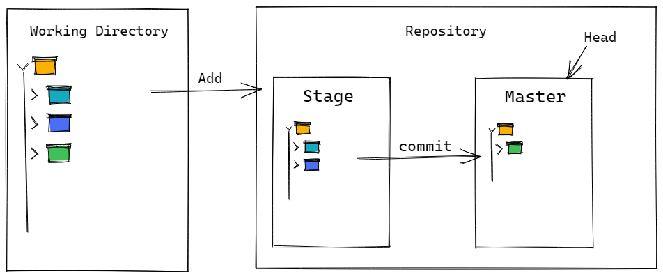

# 关于 Git 的用法指南

### 前言

本文将整理常用的 git 命令，帮助开发人员快速上手，同时记录常见的问题及其解决方案。

### 基本命令

#### 初始化

通过 `git init` 命令初始化一个空仓库，同时在当前目录下新建 `.git` 目录，该目录是 git 跟踪管理版本的库，同时包含所有操作的配置信息，默认隐藏。

```shell
$ git init
Initialized empty Git repository in /Users/Silence/learngit/.git/
```

#### 作者信息

在操作仓库前需要先设置个人信息，包含 `邮箱地址` 和 `用户名`

```shell
$ git config --global user.email "sparrow_silence@163.com"
$ git config --global user.name "Silence"
```

#### 添加文件到仓库

假设当前目录下有 `readme.md` 文件，通过命令 `git add` 将该文件添加到仓库。

```shell
$ git add readme.md
```

#### 查看仓库状态

通过 `git status` 命令可查看当前仓库的变更信息，未提交的文件将出现在 `Untracked files` 列表里。已经添加的在 `Changes to be committed` 列表里。

```shell
$ git status
On branch main

Changes to be committed:
  (use "git rm --cached <file>..." to unstage)
        new file:   README.md

Untracked files:
  (use "git add <file>..." to include in what will be committed)
        .gitignore
```

#### 提交文件到仓库

命令 `git commit -m 'type anything'` 将已经添加的文件提交到仓库，仓库保存为历史记录。

```shell
$ git commit -m 'init project'
[main bf5fc33] init project
 1 file changed, 7 insertions(+)
 create mode 100644 .gitignore
```

#### 查看仓库历史记录

命令 `git log` 查看仓库的所有提交记录。

```shell
$ git log
commit bf5fc33fdd8447d2e5ae40ec9867d9a8ea9fd1fd (HEAD -> main)
Author: Silence <sparrow_silence@163.com>
Date:   Sat Oct 30 10:26:57 2021 +0800

    init project
    
commit a1af351ed53dfb1f24e06af662025de8951e10bf (dev)
Author: Silence <sparrow_silence@163.com>
Date:   Sat Oct 30 10:13:54 2021 +0800

    测试commit
```

在后面加上 `--pretty=oneline` 参数，输出的记录会更简洁。

```shell
$ git log --pretty=oneline
bf5fc33fdd8447d2e5ae40ec9867d9a8ea9fd1fd (HEAD -> main) init project
a1af351ed53dfb1f24e06af662025de8951e10bf (dev) 测试commit
```

#### 版本回退

首先 Git 需要知道回退记录的 `HEAD`，也就是 `git log` 输出的记录里 `bf5fc33fdd...`，用 `HEAD` 表示当前版本，那 `HEAD^` 就是上一个版本，`HEAD^^` 是上上版本，以此类推，往上100个版本写成 `HEAD~100`。

命令 `git reset --hard HEAD^` 将回退到上一个版本

```shell
$ git reset --hard HEAD^
HEAD is now at a1af351 测试commit
```

也可以指定 `commit id` 回退，一般来说输入前几位就行， Git 会自动去找

```shell
$ git reset --hard bf5fc
HEAD is now at bf5fc33 init project
```

只要知道 `commit id` 就可以恢复到该记录，如果回退后， `git log` 中查不到 `commit id` ，可通过 `git reflog` 查看，该命令记录每一次命令。

```shell
$ git reflog
bf5fc33 (HEAD -> main) HEAD@{0}: reset: moving to bf5fc
a1af351 (dev) HEAD@{1}: reset: moving to HEAD^
bf5fc33 (HEAD -> main) HEAD@{2}: commit: init project
a1af351 (dev) HEAD@{3}: commit (initial): 测试commit
```

### 工作区和暂存区

#### 工作区

工作区就是建仓时所在的目录

#### 暂存区

工作区里的 `.git` 目录是 Git 的版本库。版本库里存了很多东西，其中最重要的就是 `stage` 暂存区，还有建仓时为我们自动创建的第一个分支 `master`,以及指向 `master` 的第一个指针 `HEAD`。 



所以 `git add` 的命令就是将所有修改放到暂存区 `stage`，然后执行 `git commit` 命令就可以把暂存区里所有修改都提交到分支，提交完成后，暂存区就没有任何内容了。

#### 撤销修改

##### 丢弃工作区的修改

命令 `git checkout -- file` 能够撤销修改。在修改某个文件内容后，如在 ` README.md` 文件里增加一行 `stupid boss`，使用该命令可回退到修改前状态。若已提交到暂存区则无法完成撤销修改，但提交后的修改仍可撤销。

注意命令中的 `--`，如果去掉则是切换分支命令。

```shell
$ git checkout -- README.md
```

##### 已添加到暂存区，丢弃全部修改

参考版本回退命令 `git reset HEAD <file>`，可回退到最新的分支版本，然后使用 `git checkout -- file` 撤销修改。

##### 撤销已提交的修改

如果还未提交到远程库，参考版本回退命令

#### 删除操作

删除的本质也是修改，一般情况下，通过文件管理器或者命令 `rm` 删除文件或目录。通过 `git status` 可查看当前库删除了哪些文件。

```shell
$ rm test.txt
$ git status
Changes not staged for commit:
  (use "git add/rm <file>..." to update what will be committed)
  (use "git restore <file>..." to discard changes in working directory)
        deleted:    test.txt
```

- 确认从版本库中删除，使用命令 `git rm` 删除该文件，并且 `git commit`

  ```shell
  $ git rm test.txt
  rm 'test.txt'
  $ git commit -m 'remove test.txt'
  [main 9aefaf0] remove test.txt
   1 file changed, 0 insertions(+), 0 deletions(-)
   delete mode 100644 test.txt
  ```

- 误删，从版本库中恢复，命令 `git restore <file>` 或 `git checkout -- file` 恢复文件，前提是版本库中仍有该文件。

  ```shell
  $ git restore test.txt
  
  $ git checkout -- test.txt
  ```

### 远程仓库

#### 远程库

远程库的服务器完全可以自己搭建，也可以使用现有的，比如 [GitHub](https://github.com) 和 [Gitee](https://gitee.com) 和 [`Gitee`](https://gitee.com) 和 [`Gitee`](https://gitee.com) 网站，他们都提供 Git 仓库托管服务。

由于 `GitHub` 和 `Gitee` 和本地仓库的传输是通过 `SSH` 加密的，所以需要创建 `SSH key` ，若已创建，在本地用户主目录下，会有  `.ssh` 目录，里面包含 `id_rsa` 和 `id_rsa.pub` 两个文件。若没有，可通过下面的命令生成

```shell
$ ssh-keygen -t rsa -C "sparrow_silence@163.com"
```

然后一路回车，使用默认值即可，成功生成后就能看到 `.ssh` 目录，其中 `id_rsa` 是私钥，不能泄露出去，`id_rsa.pub` 是公钥，是需要在 `GitHub` 和 `Gitee` 网站上配置的，可以放心交出，仓库托管网站通过公钥确认是你本人推送。

#### 添加远程库

假设现在本地有个 Git 仓库，`GitHub` 上也有个仓库，让这两个仓库进行远程同步，这样，远程库就可以作为备份，即使本地库丢失，也能从远程库恢复，还可以共享自己的仓库来协作。

首先在远程库网站上新建空白仓库，获取远程仓库地址，`HTTPS` 或 `SSH` 都可以，但是 `HTTPS` 每次都需要输入口令，过于麻烦。但是某些公司只开放 `HTTP` 端口，就无法使用 `SSH` 协议，只能使用 `HTTPS` 协议。

```shell
$ git remote add origin git@github.com:SparrowXc/learngit.git
```

`origin` 是远程仓库的默认名称，可以更改。然后将本地仓库的所有内容推送到远程库上：

```shell
$ git add .
$ git commit -m 'init project'
$ git push -u origin master
```

因为远程库是空仓库，在第一次推送 `master` 分支时，加上了 `-u` 参数，Git 会将本地的 `master` 分支和远程的 `master` 分支关联起来，简化之后的推送命令。之后运行命令 `git push` 就能完成推送。

#### 删除远程库关联

使用命令 `git remote rm <name>` 取消本地仓库关联的远程仓库，可以先通过 `git remote -v` 查看当前的关联信息：

```shell
$ git remote -v
origin git@github.com:SparrowXc/flexible-form.git (fetch)
origin git@github.com:SparrowXc/flexible-form.git (push)
```

然后根据远程仓库名称删除：

```shell
$ git remote rm origin
```

#### 从远程库克隆

一般来讲，从零开发的最好方式就是先创建远程仓库，然后本地克隆远程仓库。

```shell
$ git clone git@github.com:SparrowXc/flexible-form.git
Cloing into 'flexible-form'...
```

这样就完成了本地仓库和远程仓库的同步。

> 也可以通过克隆远程仓库，将目录下的 `.git` 目录移动到本地项目目录里，这样就能省去本地仓库的初始化和关联远程仓库等步骤。

### 分支管理

Git 里的分支就像是平行空间，互不干扰，但也能实现空间的合并。

#### 创建与合并分支


